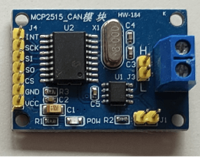
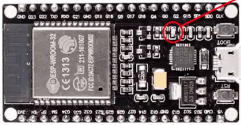
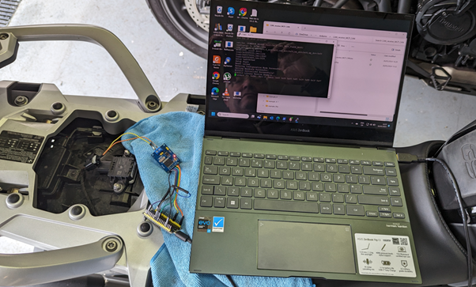
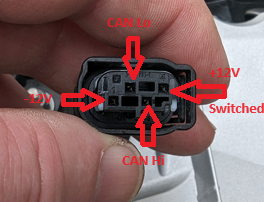

**Objective **

Create a device capable of sniffing the CAN Bus of a
2020 BMW R1250 GS motorcycle and translating the messages from the
Wonder Wheel into something which could be translated into Zoom,
Centre, 
reorientate etc on a standard Android phone or
tablet.  This will be accomplished
using an ESP32 based NodeMCU and CAN Bus
adapter. 

There are commercial products which can do this – but
I wasn’t aware of them when I started and anyway the primary aim of this
project was to learn a little about CAN-Bus and have a bit of soldering
fun.  Much of the code is borrowed
from others and I’m afraid what little I did write is
pretty poor.  

**Components **

I’m connecting to the exact items I used, but there
are many options possible for both the EPS board and the MCP based
CAN-bus adapter.  If I build
another of these I’ll probably opt for
smaller footprint irems.

[Hailege 2pcs MCP2515 CAN Bus Module TJA1050
Receiver SPI Module for Arduino AVR :
Amazon.co.uk: Business, Industry &
Science](https://www.amazon.co.uk/dp/B07Z1V2RTM?psc=1&ref=ppx_yo2ov_dt_b_product_details)

[AZDelivery 3 x ESP32-DevKitC
NodeMCU WiFi
WLAN CP2102 ESP32-WROOM-32D IoT 2-In-1 Microcontroller Bluetooth Module
Development Board compatible with Arduino including
E-Book! : Amazon.co.uk: Electronics &
Photo](https://www.amazon.co.uk/dp/B074RGW2VQ?psc=1&ref=ppx_yo2ov_dt_b_product_details)

[1/5/10/30 sets kit TE tyco AMP 4 pin male
female waterproof Audi Oxygen Sensor AV Video Audio Plug BMW auto
connector 1-967640-1
(aliexpress.com)](https://www.aliexpress.com/item/33035334981.html) 
(Not yet arrived)

I also had an old 12v-\>USB power adapter which put out 5v @3a
regulated.  I can’t see the exact
ones online anymore – but you’ll need something for the voltage
stepdown.

 

**Hardware Assembly**

Disclaimer – I’ve only assembled this in test mode and connected to a
laptop (for diagnostics and 5v power) so far, but I’ve got it
functioning end to end.

 

**NodeMCU** **\<-\> TJA1050 connections**

|  |  |  |
|----|----|----|
| NodeMCU | TJA1050 | Comment |
| GPIO25 | INT |   |
| GPIO26 | SCK | Clk pin |
| GPIO27 | SI | AKA MOSI |
| GPIO14 | SO | You need a 4k7 resistor inline here because the ESP32 pins on the NodeMCU only take 3.3v and the MCP2515 on the TJA1050 puts out 5v.  The “proper” way to do this is with a CD4050 See here [CD4050](https://www.build-electronic-circuits.com/4000-series-integrated-circuits/ic-4050/). |
| GPIO12 | CS | Chip Select |
| GND | GND |   |
| 5V | VCC |   |

 

**Bike \<-\> Voltage regulator \<-\> NodeMCU
+TJA1050 connections.**

To connect to the bike I plan to make a
“passthrough” harness with a tee off for the 4 wires to go to my
board(s) utilising a male and female version of the plugs mentioned
above from
Aliexpress. 
Pinouts shown below.

Connecting Bike \<-\> Volt Regulator \<-\>
NodeMCU + TJ1050

·        
Connect the CAN Hi & Lo from the bike to the Hi &
Lo on the TJ1050

·        
Connect power from Switched 12V to the
NodeMCU & TJ1050 via voltage regulator.

I disconnected the CAN-Bus 4 wire plug from the ABS module under the
passenger saddle and put my harness inline and reconnected.

 

**CAN-Bus messages**

A group of people have
been working on reverse engineering the BMW motorcycle CAN bus messages
in
a [Google
Spreadsheet](https://docs.google.com/spreadsheets/d/1tUrOES5fQZa92Robr6uP8v2dzQDq9ohHjUiTU3isqdc/edit#gid=0). I've used this as a reference for my parsing.

**Software**
The software is here src="code/CAN_Read_plus_Keyboard_V0.4.ino"
 

 

 

 

 

 

